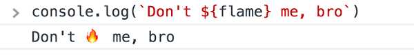
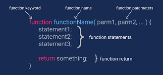
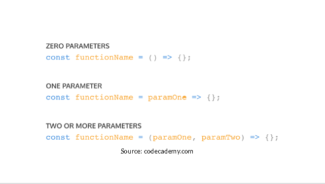
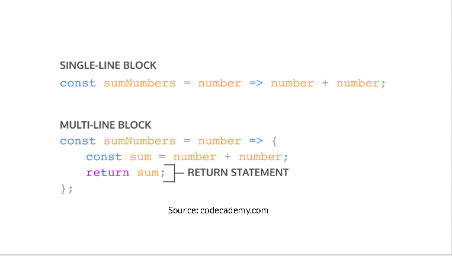
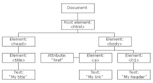

# JAVASCRIPT
---
<p align="center"></p>


## Intro javascript

* __*Javascript*__ adalah bahasa pemograman yang sangat powerful yang digunakan untuk logic pada sebuah website. Sederhananya untuk membuat website menjadi __interaktif__ dan __dinamis__.

> Javascript di jalankan melalui browser pada device setiap user, umumnya browser chrome dan mozilla yang sudah support untuk semua fiture javascript.

## Syntax And Statment

```
Alert()
Prompt()
Confirm()

// How to create variables:
var x;
let y;

// How to use variables:
x = 5;
y = 6;
let z = x + y;

let x, y, z;    // Statement 1
x = 5;          // Statement 2
y = 6;          // Statement 3
z = x + y;      // Statement 4

```
## Console log
* __Console__ __log__ juga tempat kita untuk melakukan debugging (mengetahui error pada code) pada pemrograman web.
<p align="center">
</p>

--- 

# JAVASCRIPT Comments

* __Comments__ di gunakan untuk memberikan keterangan suatu statment, baik Inggris maupun Indonesia.

> Comment tidak akan dijalankan oleh program karna tujuannya hanya di baca sesama programer atau diri sendiri untuk memahami maskud dan tujuan sebuah statmen dan syntax.

```
1. Single Line Comments

// Print 5 to the console
console.log(5);

console.log(5);     // Print 5

2. Multiline Comments

/*
this is all commentd
console.log(10);
none of this is going to run!
console.log(99);
*/
```
# JAVASCRIPT DATA TYPES

- __Number__
,tipe data number adalah tipe data yang mengandung semua angka termaksud angka desimal.
- __string__
,tipe data string adalah grup karakter yang ada pada keyboard laptop/PC kita yaitu letters(huruf), number(angka), spaces(spasi), simbol dan lainnya.
- __boolean__
,tipe data yang memiliki dua(2) buah nilai yaitu true (benar) or false (salah). analoginya seperti tombol ON/OFF.
- __null__
, tipe data yang tipe data yang di artikan bahwa sebuah variabel/data tidak memiliki nilai, null berbeda dengan srting kosong, string kosong masih memiliki tipe data string.
- __undefined__
,tipe data undifined berbeda dengan tipe data null, tipe data ini merepresentasikan variabel/data yang tidak memiliki nilai.
- __object__
,tipe data adalah koleksi data yang saling berhubungan(related), tipe data object biasanya menyimpan data dengan tipe data apapun(number,string,boolean dan lainnya)

# JAVASCRIPT VARIABELS
* Ada 3 cara mendefinisikan sebuah variabel.

1. var
```
var myName='Gorse';
console.log(myName);
// output: Gorse
```
2. let
```
let food='Humberger';
console.log(food);
// output: Humberger
```
3. const
```
const pi='3.14'
console.log (pi);
// output 3.14
```
> CAT: Gunakan Conts jika variabel tidak dapat di rubah nilainya cth: konstanta pi: 3.14

# JAVASCRIPT SCOPE
* Scope adalah konsep dalam flow data variabel. 
Menentukan suatu variabel bisa diakses pada scope tertentu atau tidak.

### __BLOCKS__

* Blocks adalah code yang berada didalam curly braces {}.
Conditional, function, dan  looping menggunakan blocks.
1. GLOBAL SCOPE
Global scope berarti variabel yang kita buat dapat diakses dimanapun dalam suatu file.
Agar menjadi Global Scope, suatu variabel harus dideklarasikan diluar Blocks.
```
let myName='Gorse';

function greeting(){
    return myName;  //output: Gorse
}

console.log(myName);  //output: Gorse  
```
2. LOCAL SCOPE
Local scope berarti kita mendeklarasikan variabel didalam blocks seperti function, conditional, dan looping.Maka variabel hanya bisa diakses didalam blocks saja. Tidak bisa diakses diluar blocks.
```
// Variebel declare in function bloks
function greeting(){
    let myName ='Gorse';
    return myName;  //output: Gorse
}

console.log(greeting()) // Gorse
console.log(myName); // uncaught RecfrenceError: myName is not difined because local scope
```
# JAVASCRIPT FUNCTION
* __Fungsi__ __JavaScript__ adalah blok kode yang dirancang untuk melakukan tugas tertentu.
Fungsi JavaScript dijalankan ketika "something" memanggilnya (calls it)
<p align="center">

</p>

### __PARAMETER__ __&__ __ARGUMEN__
* Dengan parameter, function dapat menerima sebuah inputan data dan menggunakannya untuk melakukan task/tugas.Saat membuat function/fitur, kita harus tahu data-data yang dibutuhkan. Misalnya saat membuat function penambahan 2 buah nilai. Data yang dibutuhkan adalah 2 buah nilai tersebut.
```
function penambahan(2,4) {
    return 2 + 4;
}
```
* Argumen adalah nilai yang digunakan saat memanggil function.Jumlah argumen harus sama dengan jumlah parameternyaJadi jika di function penambahan ada 2 parameter nilai saat membuat function. Saat memanggil function kita gunakan 2 buah nilai argumen.
```
function penambahan(a,b) {
    return a + b;
}

console.log(penambahan(2 + 4)) // output: 6
```
## FUNCTION HELPER
* Kita bisa menggunakan function yang sudah dibuat pada function lain.
```
function multiplyByNineFifths(number){
    return number * (9/5);
};

function getFahrenheit(celcius) {
    return multiplyByNineFifths(celcius)+ 32;
};

get getFahrenheit(15); // returns 59
```
## FUNCTION ARROW
* Arrow function adalah cara lain menuliskan function. Ini adalah fitur terbaru yang ada pada ES6 (Javascript Version).
```
const greeting= () => {
    return 'Hello World';
};
 const penambahan= (2,4) => {
    return a + b;
 };
```
## SHORT SYNTAX FUNCTION
<p align='center'>
</p>
<p align='center'>
</p>

# JAVASCRIPT DOM
* Kali ini kita akan mempelajari JavaScript HTML DOM. DOM adalah singkatan dari Document Object Model.Jadi, ketika halaman website kita diload, browser kita akan membuat Document Object Model dari halaman website kita. Kira-kira seperti ini:
<p align='center'>
</p>
Dengan adanya DOM ini, JavaScript diberi akses untuk membuat HTML menjadi dinamis, seperti:

* + Mengubah element HTML pada halaman website.
* + Mengubah attribute HTML pada halaman website.
* + Mengubah CSS style pada halaman website.
* + Menambah dan/atau menghapus element maupun    attribute HTML.
* + Menambah HTML event (contoh: efek klik pada mouse, hover pada mouse, dan lain-lain) pada halaman website.
* + Berinteraksi dengan semua HTML event di website.
* Di HTML DOM, semua element HTML dari sebuah website dianggap sebagai objek. Dan sama seperti objek JavaScript pada umumnya, objek element HTML di HTML DOM juga mempunyai properti dan method atau yang lebih dikenal dengan istilah DOM Property dan DOM Method.

* Jadi untuk mengubah nilai properti dari element HTML, kita bisa menggunakan DOM Property dan untuk memanggil fungsi dari suatu element HTML, kita bisa menggunakan DOM Method.

#### CONTOH:
misalnya kita memiliki mempunyai elemment HTML sebagai berikut:
```
<input id="umur" type="text" value="20" />
```
Untuk mengakses value dari input di atas, maka bisa dilakukan dengan cara sebagai berikut:
```
let umur = document.getElementById("umur").value;

console.log(umur); //output: 20
```
## ELEMENTS HTML
* + getElementById(id)
Method yang ini sudah kita lihat beberapa kali dari contoh-contoh sebelumnya. Kita bisa menggunakan getElementById untuk mengakses element HTML berdasarkan nilai id-nya.

* + getElementsByTagName(tag)
Untuk mengakses element-element HTML berdasarkan jenis tag-nya, kita bisa menggunakan getElementsByTagName.

* + getElementsByClassName(className)
Untuk mengakses element-element HTML berdasarkan nilai attribute class-nya, kita bisa menggunakan getElementsByClassName.

* + querySelectorAll(cssSelector)
Untuk mengakses element-element HTML berdasarkan CSS Selector-nya HTML, kita bisa menggunakan querySelectorAll.

## DOM EVENT
* Di topik Pengenalan JavaScript HTML DOM, kita tahu bahwa salah satu kegunaan dari DOM adalah untuk berinteraksi dengan HTML Event di suatu website.Pernahkan ketika kita klik 1 tombol di satu website, terkadang akan muncul popup window yang menyampaikan suatu pesan. Salah satu cara untuk melakukan itu adalah dengan menggunakan DOM Event.Ada banyak sekali tipe HTML Event di JavaScript. Kali ini kita hanya akan membahas onclick yaitu HTML Event yang akan terjadi ketika user klik suatu element HTML.
Syntax-nya adalah sebagai berikut:

>oneclick = KodeJavaScript

### CONTOH:
* Seandainya kita mempunyai satu button yang akan menampilkan popup window dengan pesan "Hello, World!", maka caranya kira-kira seperti ini:
```
<!--html-->
<button id="demo">Click Me!</button>

// js
let demo =document.getElementById("demo");
demo.oneclick = showMassage;

function showMasage() {
    alert("Hello, World!");
}
```